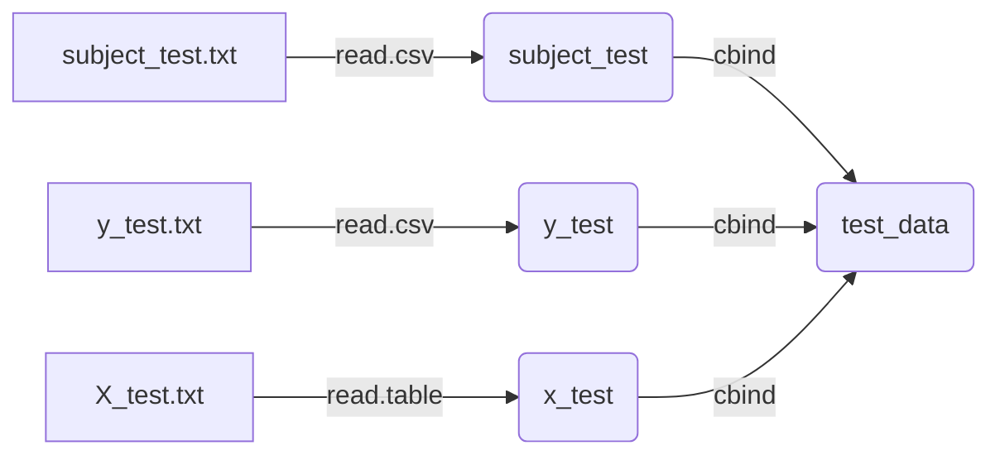
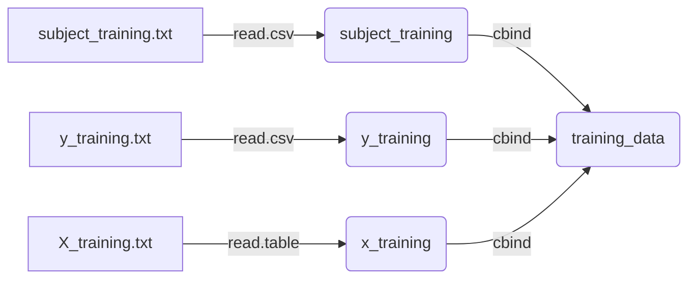
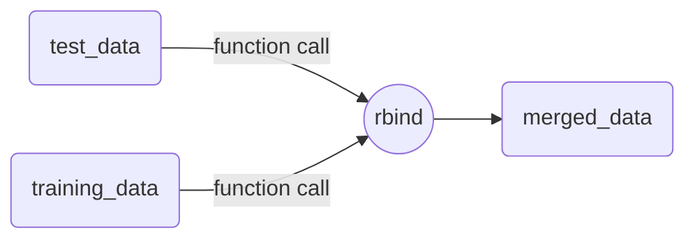

# Code Book

## Variable description
| Field Name | Possible values | Description |
|--|--|--|
| set | training | set of volunteers selected for training data |
||test| set of volunteers selected for test data |
| subject | "any integer [1 - 30]" | volunteer ID |
| activity | laying| laying | 
| | sitting | sitting | 
| | standing | standing | 
| | walking  | walking | 
| | walking downstairs | walking downstairs | 
| | walking upstairs | walking upstairs |
| feature | fBodyAccFreqX | frequency domain signal from accelerometer 
| | fBodyAccFreqY | frequency domain body signal from accelerometer
| | fBodyAccFreqZ | frequency domain body signal from accelerometer
| | fBodyAccJerkFreqX | frequency domain body signal from accelerometer
| | fBodyAccJerkFreqY | frequency domain body signal from accelerometer
| | fBodyAccJerkFreqZ | frequency domain body signal from accelerometer
| | fBodyAccJerkX | frequency domain body jerk signal from accelerometer
| | fBodyAccJerkY | frequency domain body jerk signal from accelerometer
| | fBodyAccJerkZ | frequency domain body jerk signal from accelerometer
| | fBodyAccMag | frequency domain body signal magnitude from accelerometer
| | fBodyAccMagFreq | frequency domain body signal magnitude from accelerometer
| | fBodyAccX | frequency domain body signal from accelerometer
| | fBodyAccY | frequency domain body signal from accelerometer
| | fBodyAccZ | frequency domain body signal from accelerometer
| | fBodyBodyAccJerkMag | frequency domain body jerk signal magnitude from accelerometer
| | fBodyBodyAccJerkMagFreq | frequency domain body jerk signal magnitude from accelerometer
| | fBodyBodyGyroJerkMag | frequency domain body jerk signal magnitude from gyroscope
| | fBodyBodyGyroJerkMagFreq | frequency domain body jerk signal magnitude from gyroscope
| | fBodyBodyGyroMag | frequency domain body signal magnitude from gyroscope
| | fBodyBodyGyroMagFreq | frequency domain body signal magnitude from gyroscope
| | fBodyGyroFreqX | frequency domain body signal from gyroscope
| | fBodyGyroFreqY | frequency domain body signal from gyroscope
| | fBodyGyroFreqZ | frequency domain body signal from gyroscope
| | fBodyGyroX | frequency domain body signal from gyroscope
| | fBodyGyroY | frequency domain body signal from gyroscope
| | fBodyGyroZ | frequency domain body signal from gyroscope
| | tBodyAccJerkMag | time domain body jerk signal magnitude from accelerometer
| | tBodyAccJerkX | time domain body jerk signal from accelerometer
| | tBodyAccJerkY | time domain body jerk signal from accelerometer
| | tBodyAccJerkZ | time domain body jerk signal from accelerometer
| | tBodyAccMag | time domain body signal magnitude from accelerometer
| | tBodyAccX | time domain body signal from accelerometer
| | tBodyAccY | time domain body signal from accelerometer
| | tBodyAccZ | time domain body signal from accelerometer
| | tBodyGyroJerkMag | time domain body jerk signal magnitude from gyroscope
| | tBodyGyroJerkX | time domain body jerk signal from gyroscope
| | tBodyGyroJerkY | time domain body jerk signal from gyroscope
| | tBodyGyroJerkZ | time domain body jerk signal from gyroscope
| | tBodyGyroMag | time domain body signal magnitude from gyroscope
| | tBodyGyroX | time domain body signal from gyroscope
| | tBodyGyroY | time domain body signal from gyroscope
| | tBodyGyroZ | time domain body signal from gyroscope
| | tGravityAccMag | time domain body signal magnitude from accelerometer
| | tGravityAccX | time domain gravity signal from accelerometer
| | tGravityAccY | time domain gravity signal from accelerometer
| | tGravityAccZ | time domain gravity signal from accelerometer
| measuretype | mean | mean
| | standarddeviation | standard deviation
| avg | "any numeric" | average value | 

## Data transformations

The original data came from [this link](https://d396qusza40orc.cloudfront.net/getdata%2Fprojectfiles%2FUCI%20HAR%20Dataset.zip).
Then it was transformed using [this script](https://github.com/Mitridathes/Getting-and-Cleaning-Data-Course-Project/blob/master/run_analysis.R)

The original data set was divided into diferent <code>.txt</code> files, so the script mentioned before is necessary in terms of
getting tidy data.

What that script does is:
### Downloading, unzipping and installing packages
 - Creates a new "data" direcrory in the working directory and  download and unzip the original data set.
 - If they werent installed before, it will install the dplyr, tidyr or readr packages. 
### Reading the data
As it was said before, the dataset is divided into different <code>.txt</code> files. 
 - Reads `features.txt` which has the name of every variable measured. It will be considered as the `colNames()` of `X_test.txt` and `X_train.txt`.

 - Reads the data coming from the "test" set of volunteers and joins it into the same table: 

 - Every variable is renamed and we get a table with this header where "...features..." resumes every feature.
 
| subject | activity | ..features..|
|--|--|--|
| 2 | 1 | ..0.92354.. |
 - The same is done with the training data set:

### Joining "training" and "test" data sets
 Before joining both tata tables is necessary to create a new variable that differentiates wether the data comes from "test" or "training":

| subject | activity | ..features.. | set |
|--|--|--|--|
| 2 | 1 | ..-0.92354.. | test |

Once `test_data` and `training_data` have the new set column indicating where the data belongs we can join them:

Now we get a data table with this shape:

| subject | activity | ..features.. | set |
|--|--|--|--|
| 2 | 1 | ..-0.92354.. | test |
| 1 | 3 | ..0.81562.. | training

### Tidying data

 - First thing the script does in order to get a tidy data set is eliminating every and **"-", "()"** marks using regex: "-|\\()",

There are **values as columns** in the data set:
Taking a look at the data set it could be said that there are only 4 variables, although the number of columns us much bigger. Every feature name could be just the value of a variable called "feature" and it's value could be another variable called "measure".

 - Before gathering all this data using the `tidyr package` this script creates a **new variable** to **count the number of observations** each subject has in every activity. This is created with a for loop.
 - With this new column the dataset looks like this:

| subject | activity | ..features.. | set | observation |
|--|--|--|--|--|
| 1 | 1 | ..-0.92354.. | test | 1 |
| 1 | 1 | ..-0.81562.. | test |2 |

This part is important in order to be able to identify the observation to which any feature corresponds once all the features are gathered.

 - Next step to get tidy data is changing the values in activity by their **names** in the `activity_labels.txt` file in **lowercases**.

| subject | activity | ..features.. | set | observation |
|--|--|--|--|--|
| 1 | walking | ..-0.92354.. | test | 1 |
| 1 | walking | ..-0.81562.. | test |2 |

 - Gathering every "features" variables into just 2 columns called "feature" and "measure". For this step is necessary the use of tydr package.

| subject | activity | set | observation |  feature | measure |
|--|--|--|--|--|--|--|
| 1 | walking | test | 1 | fAccmean-X | -0.92354 |
| 1 | walking | test | 2 | fAccmean-X | -0.81562 |
